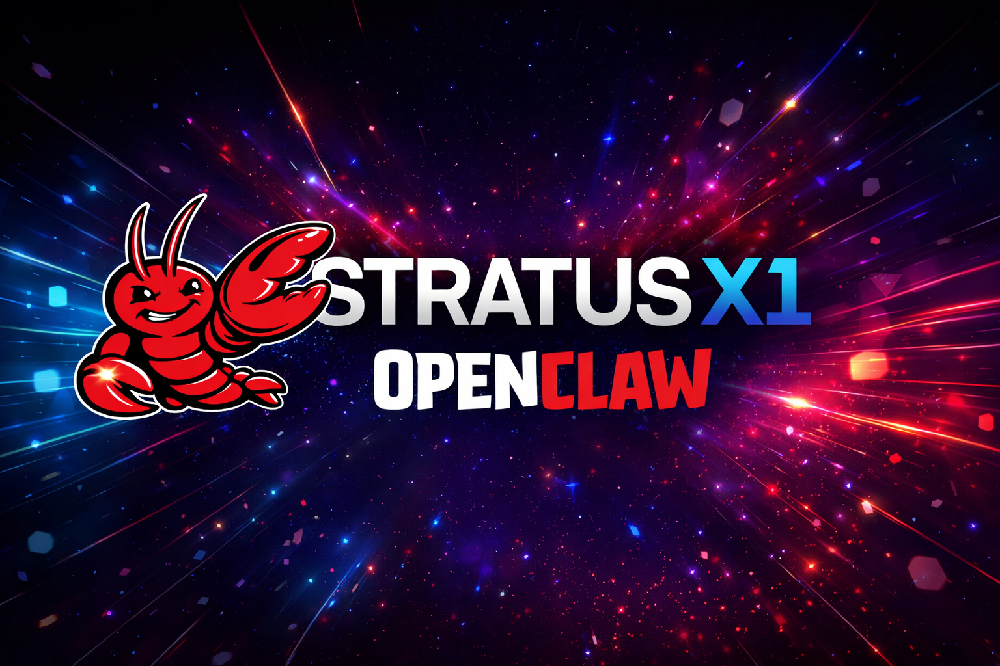

<div align="center">



# Stratus X1-AC Plugin for OpenClaw

</div>

Integrate Stratus V3 (X1-AC), a state-of-the-art action-conditioned JEPA (Joint-Embedding Predictive Architecture), into OpenClaw for autonomous agent planning and semantic state understanding.

## Features

- **Model Provider**: Use Stratus models (GPT-4o or Claude Sonnet 4 backends) for agent conversations
- **Embeddings Tool**: Generate 768-dimensional semantic state embeddings
- **Rollout Tool**: Multi-step task planning with action sequence prediction
- **Secure**: API key authentication with automatic validation
- **Opt-in Tools**: Tools are optional and require explicit allowlisting

## Support

- **Documentation**: [https://stratus.run/docs](https://stratus.run/docs)
- **Issues**: [https://github.com/formthefog/openclaw-stratus-x1-plugin/issues](https://github.com/formthefog/openclaw-stratus-x1-plugin/issues)
- **API Key**: [https://stratus.run](https://stratus.run)

## Installation

### Quick Start (3 Steps) ✨

> **Note:** This plugin does NOT have an automatic postinstall script. You must run setup manually.

```bash
# 1. Install the plugin
openclaw plugins install @formthefog/stratus

# 2. Run setup (in any OpenClaw chat interface)
/stratus setup

# 3. Verify everything works
/stratus verify
```

**That's it!** The `/stratus setup` command handles:
- ✅ API key configuration
- ✅ OpenClaw config updates
- ✅ Auth profile creation
- ✅ Model registration
- ✅ Gateway restart prompt

**No manual config editing required!** 🧈

> **Tip:** Once installed, you can also access Stratus models with `/model stratus` in chat.

---

## Available Commands

Use these slash commands in any OpenClaw chat (TUI, Telegram, Discord, etc.):

| Command | Description |
|---------|-------------|
| `/stratus` | Show help |
| `/stratus setup` | Interactive configuration wizard |
| `/stratus verify` | Verify plugin is configured correctly |

---

## What `/stratus setup` Does

The interactive setup command will:

1. ✅ Prompt for your Stratus API key
2. ✅ Update OpenClaw configuration
3. ✅ Configure authentication profiles
4. ✅ Add model aliases
5. ✅ (Optional) Add environment variables to your shell config

---

## Testing Your Installation

After setup, verify everything works:

```
# In chat:
/stratus verify

# Then try the model:
/model stratus
Hello from Stratus!
```

---

## Alternative Installation Methods

### Via OpenClaw (Recommended)

```bash
openclaw plugins install @formthefog/stratus
```

### Via npm (for development or testing)

```bash
npm install -g @formthefog/stratus
```

> **Note:** When installing via npm, you'll still need to manually configure OpenClaw. The `openclaw plugins install` method is recommended as it handles setup automatically.

### From OpenClaw Monorepo

If you're developing in the OpenClaw monorepo, the plugin is already available:

```bash
cd /path/to/openclaw
pnpm install
```

## Configuration

### 1. Get Your API Key

Sign up at [stratus.run](https://stratus.run) to get your API key (format: `stratus_sk_...`).

### 2. Set Environment Variable

```bash
export STRATUS_API_KEY=stratus_sk_live_your_key_here
```

Or add to your shell profile (`~/.bashrc`, `~/.zshrc`, etc.):

```bash
echo 'export STRATUS_API_KEY=stratus_sk_live_your_key_here' >> ~/.zshrc
```

### 3. Configure OpenClaw

Run the onboarding wizard:

```bash
openclaw onboard
```

Select "Stratus" as a provider and enter your API key when prompted.

**Manual Configuration** (alternative):

Edit `~/.openclaw/openclaw.json`:

```json
{
  "plugins": {
    "stratus": {
      "enabled": true,
      "apiKey": "${STRATUS_API_KEY}",
      "baseUrl": "https://dev.api.stratus.run",
      "provider": {
        "enabled": true,
        "defaultModel": "stratus-x1ac-base-claude-sonnet-4-5"
      },
      "tools": {
        "embeddings": { "enabled": true },
        "rollout": { "enabled": true }
      }
    }
  }
}
```

## Usage

### 1. Use Stratus as a Model Provider

Use Stratus models for agent conversations:

```bash
# Use Claude Sonnet 4.5 backend (recommended)
openclaw agent --model stratus/stratus-x1ac-base-claude-sonnet-4-5 \
  "Explain action-conditioned state prediction"

# Use GPT-4o backend
openclaw agent --model stratus/stratus-x1ac-base-gpt-4o \
  "Help me plan a complex task"

# Use smaller model for faster responses
openclaw agent --model stratus/stratus-x1ac-small-claude-haiku-4-5 \
  "Quick question: what is JEPA?"
```

**Available Models: 75 Total**

The plugin registers all 75 Stratus chat completion models:

**Model Format:** `stratus-x1ac-{size}-{llm}`

**Sizes:** `small`, `base`, `large`, `xl`, `huge`

**OpenAI LLMs:**

- `gpt-4o` - GPT-4 Optimized (latest)
- `gpt-4o-mini` - Smaller, faster GPT-4o
- `gpt-4-turbo` - GPT-4 Turbo
- `gpt-4` - GPT-4 base
- `gpt-3.5-turbo` - GPT-3.5 Turbo

**Anthropic LLMs (Claude 4.x):**

- `claude-sonnet-4-5` - Claude 4.5 Sonnet (recommended)
- `claude-opus-4-5` - Claude 4.5 Opus
- `claude-haiku-4-5` - Claude 4.5 Haiku (fast)
- `claude-sonnet-4` - Claude 4 Sonnet
- `claude-opus-4` - Claude 4 Opus

**Anthropic LLMs (Claude 3.x - Legacy):**

- `claude-3-7-sonnet`, `claude-3-5-sonnet`, `claude-3-opus`, `claude-3-sonnet`, `claude-3-haiku`

**Examples:**

- `stratus/stratus-x1ac-base-claude-sonnet-4-5` (recommended)
- `stratus/stratus-x1ac-base-gpt-4o`
- `stratus/stratus-x1ac-large-claude-opus-4-5` (high performance)
- `stratus/stratus-x1ac-small-gpt-4o-mini` (development/testing)

### 2. Use Stratus Tools

#### Enable Tools (Allowlist)

Tools are opt-in for security. Enable them in your config:

```bash
# Enable both tools
openclaw config set agents.defaults.tools.allow '["stratus_embeddings", "stratus_rollout"]'

# Or enable only specific tools
openclaw config set agents.defaults.tools.allow '["stratus_rollout"]'
```

#### Embeddings Tool

Generate semantic embeddings for state understanding:

```bash
openclaw agent "Generate embeddings for these states: ['idle', 'working', 'completed']"
```

The agent will invoke:

```json
{
  "tool": "stratus_embeddings",
  "input": ["idle", "working", "completed"]
}
```

**Use Cases:**

- Semantic search over states
- State similarity comparison
- Memory indexing
- Context clustering

#### Rollout Tool

Plan multi-step action sequences:

```bash
openclaw agent "Plan the steps to book a hotel room"
```

The agent will invoke:

```json
{
  "tool": "stratus_rollout",
  "goal": "hotel room booked",
  "max_steps": 10
}
```

**Use Cases:**

- Task decomposition
- Action planning
- Goal-oriented reasoning
- Multi-step workflows

### 3. Combined Usage

Use Stratus models WITH tools for maximum capability:

**Config:**

```json
{
  "agent": {
    "model": "stratus/stratus-x1ac-base-claude-sonnet-4-5"
  },
  "agents": {
    "defaults": {
      "tools": {
        "allow": ["stratus_embeddings", "stratus_rollout"]
      }
    }
  }
}
```

**Example Conversation:**

```bash
openclaw agent
> I need to plan a trip to Paris. First, analyze the semantic similarity
> of these activities: ['visit Eiffel Tower', 'Seine river cruise', 'Louvre museum'].
> Then, create a step-by-step plan to book everything.

# Agent uses:
# 1. stratus_embeddings() to analyze activity similarity
# 2. stratus_rollout() to generate booking plan
# 3. Stratus X1AC model for reasoning and response
```

## Tool Reference

### `stratus_embeddings`

Generate 768-dimensional semantic embeddings.

**Parameters:**

- `input` (string | string[]): Text(s) to embed
- `model` (string, optional): Model to use (default: `stratus-x1ac-base`)
- `encoding_format` (string, optional): `float` or `base64` (default: `float`)

**Returns:**

```json
{
  "content": [{ "type": "text", "text": "Generated 3 embeddings (768 dimensions each)" }],
  "details": {
    "data": [
      { "embedding": [0.1, 0.2, ...], "index": 0 },
      ...
    ],
    "usage": { "prompt_tokens": 10, "total_tokens": 10 }
  }
}
```

### `stratus_rollout`

Multi-step rollout planning.

**Parameters:**

- `goal` (string): Target state to achieve
- `initial_state` (string, optional): Starting state
- `max_steps` (number, optional): Max steps (default: 10, max: 50)
- `return_intermediate` (boolean, optional): Return intermediate states (default: true)

**Returns:**

```json
{
  "content": [{
    "type": "text",
    "text": "Successfully planned 5 steps\nGoal: book hotel\n\nSteps:\n1. Search hotels\n2. ..."
  }],
  "details": {
    "goal": "book hotel",
    "steps": [
      { "action": "search_hotels", "description": "Search for hotels" },
      ...
    ],
    "success": true
  }
}
```

## Security

### API Key Protection

- **Storage**: Store in `STRATUS_API_KEY` environment variable (not in config files)
- **Validation**: Automatically validates `stratus_sk_*` format
- **Redaction**: Keys are redacted in logs (`[REDACTED]`)

### Tool Access Control

Tools are **opt-in only**:

- Registered with `{ optional: true }`
- Must be explicitly added to `agents.defaults.tools.allow`
- Not available unless allowlisted

### Input Validation

- All tool parameters validated via TypeBox schemas
- API responses validated before processing
- Error handling prevents information leakage

## Troubleshooting

### Quick Fixes

#### "Stratus API key not configured"

**Solution**:

```bash
export STRATUS_API_KEY=stratus_sk_live_your_key_here
```

#### "Invalid Stratus API key format"

**Solution**: Verify your API key from stratus.run starts with `stratus_sk_`.

#### "Tool not available"

**Solution**:

```bash
openclaw config set agents.defaults.tools.allow '["stratus_embeddings", "stratus_rollout"]'
```

#### "Stratus API error (401)"

**Solution**: Get a new API key from stratus.run and update **both** config files:
- `~/.openclaw/openclaw.json`
- `~/.openclaw/agents/main/agent/auth-profiles.json`

Then restart: `openclaw gateway restart`

#### Silent Fallback to Anthropic

If SIGBART ignores your Stratus config, see [TROUBLESHOOTING.md](./TROUBLESHOOTING.md#silent-fallback-to-anthropic-sigbart-ignores-stratus-config) for the auth cache fix.

### Full Troubleshooting Guide

For detailed debugging steps and solutions to common issues, see **[TROUBLESHOOTING.md](./TROUBLESHOOTING.md)**.

## Architecture

### Hybrid Plugin Design

Stratus has dual capabilities:

1. **Provider** (standard LLM API):
   - `/v1/chat/completions`
   - `/v1/messages`
   - Registered via `api.registerProvider()`

2. **Tools** (specialized capabilities):
   - `/v1/embeddings` → `stratus_embeddings`
   - `/v1/rollout` → `stratus_rollout`
   - Registered via `api.registerTool()`

This follows UNIX philosophy: clean separation, composable interfaces, transparent behavior.

### Configuration Schema

```typescript
interface StratusPluginConfig {
  enabled: boolean; // Enable plugin
  apiKey: string; // API key (or env var)
  baseUrl: string; // API base URL
  provider: {
    enabled: boolean; // Enable provider registration
    defaultModel: string; // Default model
  };
  tools: {
    embeddings: { enabled: boolean };
    rollout: { enabled: boolean };
  };
}
```

## Examples

### Semantic State Search

```bash
openclaw agent --model stratus/stratus-x1ac-base-claude-sonnet-4-5 << 'EOF'
I have these system states: ['initializing', 'loading', 'ready', 'processing', 'error'].
Use embeddings to find which states are semantically similar.
EOF
```

### Task Planning Workflow

```bash
openclaw agent --model stratus/stratus-x1ac-base-claude-sonnet-4-5 << 'EOF'
I need to deploy a web application. Use rollout planning to generate the steps,
considering: code push, build, test, deploy, verify.
EOF
```

### Combined Planning + Embeddings

```bash
openclaw agent --model stratus/stratus-x1ac-base-claude-sonnet-4-5 << 'EOF'
I want to organize a conference. First, generate embeddings for these tasks:
['venue booking', 'speaker invitations', 'catering', 'registration system'].
Then use rollout to plan the optimal sequence.
EOF
```

## Development

### File Structure

```
extensions/stratus/
├── index.ts              # Plugin entry point
├── package.json          # Package metadata
├── tsconfig.json         # TypeScript config
├── README.md             # This file
└── src/
    ├── client.ts         # Stratus API client
    ├── config.ts         # Config schema
    └── types.ts          # TypeScript types
```

### Adding New Endpoints

To add a new Stratus endpoint:

1. Add types to `src/types.ts`
2. Add client method to `src/client.ts`
3. Register tool in `index.ts`
4. Update README with usage

## Uninstallation

To completely remove the Stratus plugin from OpenClaw:

### Quick Uninstall (Automated)

```bash
# 1. Disable the plugin via config
openclaw config patch '{"plugins":{"entries":{"stratus":{"enabled":false}},"installs":{"stratus":null}},"models":{"providers":{"stratus":null}},"agents":{"defaults":{"models":{"stratus/stratus-x1ac-base-claude-sonnet-4-5":null,"stratus/stratus-x1ac-base-gpt-4o":null}}}}'

# 2. If your primary model was Stratus, switch back to Anthropic:
openclaw config patch '{"agents":{"defaults":{"model":{"primary":"anthropic/claude-sonnet-4-5"}}}}'

# 3. Restart gateway
openclaw gateway restart

# 4. (Optional) Clean up auth cache
rm ~/.openclaw/agents/main/agent/auth-profiles.json
openclaw gateway restart
```

### Manual Uninstall (Step-by-Step)

**1. Disable plugin in config:**

Edit `~/.openclaw/openclaw.json`:

```json
{
  "plugins": {
    "entries": {
      "stratus": {
        "enabled": false
      }
    }
  }
}
```

**2. Remove provider and model references:**

```json
{
  "models": {
    "providers": {
      // Remove entire "stratus" section
    }
  },
  "agents": {
    "defaults": {
      "model": {
        "primary": "anthropic/claude-sonnet-4-5"  // Switch back to default
      },
      "models": {
        // Remove stratus model aliases
      }
    }
  }
}
```

**3. Clean auth cache:**

OpenClaw caches API keys in `~/.openclaw/agents/main/agent/auth-profiles.json`. Remove the Stratus entry:

```json
{
  "profiles": {
    "stratus:default": null  // Remove this entire entry
  },
  "lastGood": {
    "stratus": null  // Remove this
  }
}
```

Or delete the entire file and restart (OpenClaw will regenerate it):

```bash
rm ~/.openclaw/agents/main/agent/auth-profiles.json
```

**4. Restart gateway:**

```bash
openclaw gateway restart
```

**5. (Optional) Remove plugin files:**

If installed via ClawHub:

```bash
rm -rf ~/.openclaw/plugins/stratus
```

If installed from local path, the plugin files remain at their original location. Update your config to remove the path reference:

```json
{
  "plugins": {
    "load": {
      "paths": [
        // Remove "/path/to/openclaw-stratus-x1-plugin"
      ]
    }
  }
}
```

**6. (Optional) Remove environment variable:**

If you added `STRATUS_API_KEY` to your shell profile:

```bash
# Edit ~/.zshrc or ~/.bashrc and remove:
# export STRATUS_API_KEY=stratus_sk_...
```

### Verification

After uninstall, verify Stratus is gone:

```bash
# Should not show Stratus models
openclaw agent --help | grep stratus

# Should not show Stratus tools
openclaw tools list | grep stratus
```

### Known Issues

**Issue:** After uninstall, `oc models` still shows Stratus

**Cause:** Model aliases are cached separately from provider config.

**Fix:** Use the config patch command above or manually remove from `agents.defaults.models`.

---

**Note:** OpenClaw doesn't currently support plugin lifecycle hooks (`postuninstall`), so cleanup must be done manually. We're tracking this as a feature request: [openclaw#XXXX](https://github.com/openclaw/openclaw/issues).


## Contributing

Contributions welcome! Please:

1. Follow existing code style
2. Add tests for new features
3. Update documentation
4. Ensure TypeScript types are complete

## License

MIT

## Links

- [Stratus Website](https://stratus.run)
- [OpenClaw Documentation](https://docs.openclaw.ai)
- [API Documentation](https://stratus.run/docs)
- [GitHub Issues](https://github.com/openclaw/openclaw/issues)

## Support

- **Bug reports**: [GitHub Issues](https://github.com/openclaw/openclaw/issues)
- **Feature requests**: [GitHub Discussions](https://github.com/openclaw/openclaw/discussions)
- **Stratus API issues**: support@stratus.run
